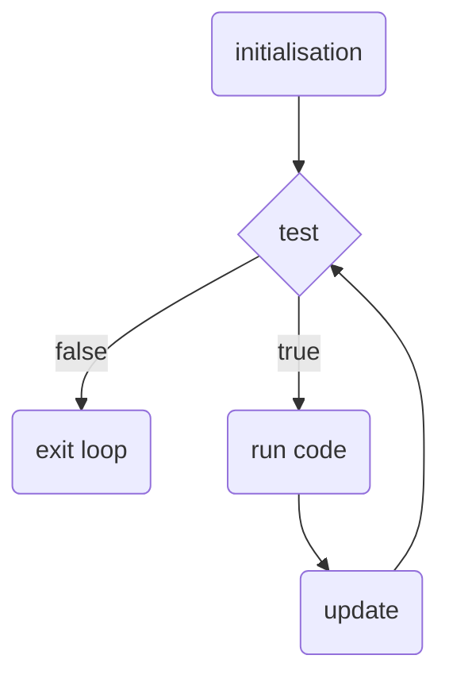

# Foundation

## Introduction
Processing is a programming environment that was first created to make it easier to develop visual applications with an emphasis on generative techniques, animation and interaction. The original developers of Processing wanted to be able to "sketch" ideas in code, this idea of quickly implementing ideas in code remains evident in the use of the terms "sketch" and "sketchbook" to refer to individual programs and collections of programs that you create over time. As its capabilities have expanded over the past two decades, Processing has come to be used for more advanced applications. Originally developed around a domain-specific extension to the Java programming language, intended for digital artists and designers, Processing has evolved into a full-blown design and prototyping tool used for large-scale art installations, motion graphics production, complex data visualisation, and creative tools development. Case studies of Processing used in production can be found at https://processing.org/exhibition/

> TODO: Something about Processing being translated to Javascript and Python

> NOTE: Should I try to cover both Processing and P5.js in a single document or create two versions of the same document, one using Processing and the other using P5.js?

> NOTE: Can P5.js send OSC messages? Can P5.js talk to Arduino?

The latest version of Processing can be downloaded from https://processing.org/download/

## The Processing Development Environment
A Processing program is called a sketch. The idea behind Processing is that we often want to quickly try out some code, much like we might want to sketch out some ideas on a piece of paper. Sketches are stored in your sketchbook, which is simply a folder on your computer that is used as the default location for saving all of your projects. Sketches stored in your sketchbook can be accessed from the menu `File > Sketchbook`. If you want to load a file from an alternative location, use the menu `File > Open...`

### The Main Window

> _Figure 1. The Processing Development Environment_

The above figure shows the Processing Development Environment. The large area in the main window is the _text editor_ and the row of buttons across the top of the window is the _toolbar_, which is where you can quickly Run, Stop and Debug your sketch. Directly above the _text editor_ are tabs, which show the names of the files that currently make up your sketch. For a simple sketch we will have only one tab, because we have only one file, and this tab will show the name of our sketch, which is always displayed as the first tab. The area below the _text editor_ is called the _console_, you will see messages from Processing appear here, e.g., if there is a problem with your code you will wee errors here, and you can display text here from within your running program, which can be very helpful, e.g., if you quickly want to check the value of a calculation. The small square window is the _display window_, the graphical output of a running sketch.

### The Library Manager

> _Figure 2. The Libraries Manager_

The core functionality of Processing is sufficient for developing many sketches. When you need to do something that's not available in Processing directly, you can use a library to add the functionality you need. Libraries can be installed by navigating to the menu `Sketch > Import Library... > Add Library...`

### The Processing Reference
An overview of the functionality available in Processing can be found on the Processing web site (https://processing.org/reference/). To quickly access the reference page explaining the usage of a certain function from within Processing, highlight the code in the _text editor_ and either right-click and select `Find in Reference` from the pop-up menu or use the main menu and select `Help > Find in Reference`.

## Your First Processing Sketch
Create a new sketch in Processing using the menu `File > New`, in the _text editor_ of the window that opens, type the following:

```java
ellipse(50, 50, 80, 80);
```

This line of code means "draw an ellipse, with the center 50 pixels over from the left and 50 pixels down from the top, with a width and height of 80 pixels." Click the Run button in the _toolbar_ or choose `Sketch > Run` from the menu bar.

<div id="sketch1_container"></div>
<script>
  const sketch1 = p => {
    p.setup = function() {
      p.createCanvas(100, 100);
      p.background(255-32);
      p.ellipse(50, 50, 80, 80);
    };
  };
  let sketch1_instance = new p5(sketch1, "sketch1_container");
</script>

If you've typed everything correctly, you’ll see the ellipse image appear in a _display window_.

If you didn't type it correctly, the _console_ will display some text about the error. If this happens, don't worry, this is a normal part of programming. Here are some things you might want to check:

1. The spelling of `ellipse`, notice that the text is all lowercase
2. After `ellipse` are four numbers in round parentheses (i.e. brackets)
3. Between each of the four numbers is a comma (`,`)
4. At the end of the line there is a semicolon (`;`)

One of the most difficult things about getting started with programming is that you have to be very specific about the syntax. The Processing software isn’t always smart enough to know what you mean, and can be quite fussy about the placement of punctuation. You’ll get used to it with a little practice.

## Drawing

### The Coordinate System
Often, the first line of a simple Processing sketch contains a call to the function `size(200, 200)`{.language-js}, which in Processing creates a _display window_ of with the given dimensions in pixels:  
```java
size(200, 200);
```

The equivalent in P5.js is to call `createCanvas()`{.language-js} to create an HTML `<canvas>`{.language-html} element on the webpage:
```js
createCanvas(200, 200);
```

### Drawing Functions
Functions are the basic building blocks of a Processing program. The behaviour of a function is defined by its parameters, a set of arguments enclosed in parentheses. Processing includes a collection of functions to draw basic shapes. For example, to draw a single line, we need four parameters: two for the starting location and two for the end.

<div id="line_sketch_container"></div>
<p><code>line(10, 90, 70, 20)</code></p>
<script>
  const line_sketch = p => {
    p.setup = function() {
      p.createCanvas(100, 100);
      p.background(255 - 32);
      p.line(10, 90, 70, 20);
    };
  };
  new p5(line_sketch, "line_sketch_container");
</script>

<div id="triangle_sketch_container"></div>
<p><code>triangle(10, 90, 70, 80, 30, 10)</code></p>
<script>
  const triangle_sketch = p => {
    p.setup = function() {
      p.createCanvas(100, 100);
      p.background(255 - 32);
      p.triangle(10, 90, 70, 80, 30, 10);
    };
  };
  new p5(triangle_sketch, "triangle_sketch_container");
</script>

<div id="rect_sketch_container"></div>
<p><code>rect(30, 20, 50, 60)</code></p>
<script>
  const rect_sketch = p => {
    p.setup = function() {
      p.createCanvas(100, 100);
      p.background(255 - 32);
      p.rect(30, 20, 50, 60);
    };
  };
  new p5(rect_sketch, "rect_sketch_container");
</script>

<div id="ellipse_sketch_container"></div>
<p><code>ellipse(50, 40, 60, 50)</code></p>
<script>
  const ellipse_sketch = p => {
    p.setup = function() {
      p.createCanvas(100, 100);
      p.background(255 - 32);
      p.ellipse(50, 40, 60, 50);
    };
  };
  new p5(ellipse_sketch, "ellipse_sketch_container");
</script>

### Drawing Order
When a program runs, the computer starts at the top and reads each line of code until it reaches the last line and then stops. If you want a shape to be drawn on top of all other shapes, it needs to follow the others in the code.

```java
rect(20, 20, 40, 60);
ellipse(60, 50, 30, 30);
```

<div id="order_sketch1_container"></div>
<script>
  const order_sketch1 = p => {
    p.setup = function() {
      p.createCanvas(100, 100);
      p.background(255 - 32);
      p.rect(20, 20, 40, 60);
      p.ellipse(60, 50, 30, 30);
    };
  };
  new p5(order_sketch1, "order_sketch1_container");
</script>

```java
ellipse(60, 50, 30, 30);
rect(20, 20, 40, 60);
```

<div id="order_sketch2_container"></div>
<script>
  const order_sketch2 = p => {
    p.setup = function() {
      p.createCanvas(100, 100);
      p.background(255 - 32);
      p.ellipse(60, 50, 30, 30);
      p.rect(20, 20, 40, 60);
    };
  };
  new p5(order_sketch2, "order_sketch2_container");
</script>

> TODO: Drawing Modes

> TODO: Drawing Styles?

## Programming Basics

### Comments
Comments are parts of the program that are ignored when the program is run. They are useful for making notes for yourself that explain what's happening in the code. If others are reading your code, comments are especially important to help them understand your thought process. Comments are also useful for trying things in your code without loosing the original attempt.

```java
// This is a comment on one line

/* This is a comment that
spans several lines
of code */
```

Single line comments can be very useful to add a comment to the end of some code, like this:

```java
background(255); // set the window background to white
```

Multi-line comments can be very useful for writing longer comments at the beginning of sketches, which can be very helpful when you come back to some code you've written previously, like this:

```java
/*
This is an example of a sketch that uses Processing to generate complex patterns with very little code.
*/
```

### Variables
A variable stores a value in memory so that it can be used later in a program. The variable can be used many times within a single program, and the value is easily changed while the program is running. When you create variables, you determine the name, the data type, and the value. The name is what you decide to call the variable. Choose a name that is informative about what the variable stores, but be consistent and not too verbose. For instance, the variable name “radius” will be clearer than “r” when you look at the code later. When declaring a variable, you also need to specify its data type (such as int), which indicates what kind of information is being stored. There are data types to store each kind of data: integers (whole numbers), floating-point (decimal) numbers, characters, words, images, fonts, and so on. After the data type and name are set, a value can be assigned to the variable. Remember that each variable can only be used once with the same name in the same part of the program.

```java
int x = 12; // Declare x as an int variable and assign a value
```

The most common Processing data types:

Data Type | Example Usage | Usage Description
---------:|:--------------|:-----------------
`int` | `int number = 2;` | An integer (whole number).
`float` | `float number = 3.14;` | A floating-point (decimal) number.
`boolean` | `boolean fact = true;` | A true or false (logical) value.
`char` | `char key = 'a';` | A letter or Unicode symbol.
`String` | `String name = "hello";` | A list (or string) of chars.

In addition to the above data types, which all come from the Java programming language, Processing adds a special data type, `color`, for specifying and working with colours. We will return to the topic of working with colours later.

> TODO: Add section on color data type?
> TODO: Statements

### Conditionals
A conditional checks that a condition has been met before executing a code block. The code between the curly braces `{` `}` is called a code block, and is something that you will see a lot in Processing.

In the following code, the conditional tests whether the value of `diam` is less than or equal to 400. If it is, the code block (inside the curly braces) executes. If not, the code block is skipped:

```java
// check a condition
if (diam <= 400) {
  // execute code between the braces
  // if condition is met
}
```

The conditional statement can be expressed as a comparison between two values with a relational operator. Relational operators inclulde:

Operator | Example Usage | Description
--: | ---- | ----
`>` | `a > b` | Greater than
`<` | `a < b` | Less than
`>=` | `a >= b` | Greater than or equal to
`<=` | `a <= b` | Less than or equal to
`==` | `a == b` | Equal to
`!=` | `a != b` | Not equal to

You can also use an `else` clause as part of a conditional statement, which provides a block of code to be executed if the condition isn't met:

```java
if (diam <= 400) {
  // execute this code if diam <= 400
} else {
  // execute this code otherwise (i.e. if diam > 400)
}
```

By setting a conditional you're creating two (or more) different paths that the execution can flow along, the computer will follow only one path through the conditional.

In addition to relational operators described above, logic operators can be used to combine the results of condition tests. Logic operators include:

Logical OR is written as `||` — `a || b` is true if `a` or `b` (or both) are true.
Logical AND is written as `&&` — `a && b` is true if (and only if) both `a` and `b` are true
Logical NOT is written as `!` — `!a` is true if `a` is false

### Loops
As you write more programs, you'll notice that patterns occur when lines of code are repeated, but with slight variations. A code structure called a loop makes it possible to run a line of code more than once to condense this type of repetition into fewer lines. This makes your programs more modular and easier to change.

#### While Loops
While loops are the simplest kind of loop, they repeat the execution of the code within the loop's code block (indicated with curly braces) as long as the conditional test (within the round parentheses) is true. The following code prints the numbers from `99` to `1` on the _console_ and then finishes by printing `zero`.

```java
int number = 99;
while (number > 0) {
  println(number);
  number--;
}
println("zero");
```

#### For Loops
The for loop is used when you want to iterate through a set number of steps, rather than just wait for a condition to be satisfied. The syntax is as follows:

```java
for (initialisation; test; update) {
  code to be executed
}
```

The code block will be executed on each iteration of the loop. Inside the round parentheses are three statements, separated by semicolons, that work together to control how many times the code inside is executed. From left to right, these statements are referred to as _initialisation_, _test_, and _update_. The _initialisation_ typically declares a new variable to use within the for loop and assigns it a value. (The variable name `i` is frequently used, but is not the only, and often not the best option.) The _initialisation_ is executed only once at the start of the loop. The _test_ checks whether the loop should continue, typically this evaluates the value of the variable created in the _initialisation_, the code in the _test_ is executed before the code block is executed. Finally, _update_ is after the code block each time it is executed, typically _update_ changes the value of the variable created in _initialisation_ and checked in _test_.

Here is an flow diagram that summarises the above description:

_Flow diagram for a `for` loop_

Here is an example of a typical for loop:
```java
for (int i = 0; i < 10; i++) {
  println(i);
}
```

Notice that this loop _does not_ print `10` to the console. This is because the test `i < 10` evaluates to `false` (i.e. `10 < 10` is not true) _before_ the code block is executed.

Here's an example of using a `for` loop to draw a simple pattern:
```java
size(400, 200);
strokeWeight(5);
for (int x = 40; x <= width-40; x += 20) {
  line(x+10, 40, x-10, height-40);
}
```
This is what this sketch looks like when run:

<div id="loop_sketch1_container"></div>

<script>
  const loop_sketch1 = p => {
    p.setup = function() {
      p.createCanvas(400, 200);
      p.background(255 - 32);
      p.stroke(0);
      p.strokeWeight(5);
      for (let x = 40; x <= p.width - 40; x += 20) {
        p.line(x+10, 40, x-10, p.height-40);
      }
    };
  };
  let loop_sketch1_instance = new p5(loop_sketch1, "loop_sketch1_container");
</script>

For comparison, here is the same pattern drawn with a `while` loop:
```java
size(400, 200);
strokeWeight(5);
int x = 40;
while(x <= width-40) {
  line(x+10, 40, x-10, height-40);
  x += 20;
}
```
Notice how the elements of the `for` loop are still present in the `while` loop, i.e., `int x = 40;` appears before the loop, `x <= width-40` appears in the conditional test, and `x += 20` appears at the end of the code block. The advantage of using a `for` loop is that these three elements are brought together in one place, so it is often easier to see how they will work.

And it produces exactly the same pattern:

<div id="loop_sketch2_container"></div>

<script>
  const loop_sketch2 = p => {
    p.setup = function() {
      p.createCanvas(400, 200);
      p.background(255 - 32);
      p.stroke(0);
      p.strokeWeight(5);
      let x = 40;
      while (x <= p.width - 40) {
        p.line(x+10, 40, x-10, p.height-40);
        x += 20;
      }
    };
  };
  let loop_sketch2_instance = new p5(loop_sketch2, "loop_sketch2_container");
</script>


#### Loops in Loops
When one for loop is embedded inside another, the number of repetitions is multiplied. 

The following sketch is an example of using one loop inside another this way:
```java
size(395, 170);
for (int x = 10; x < width; x += 15) {
  for (int y = 10; y < height; y += 15) {
    ellipse(x, y, 10, 10);
  }
}
```

<div id="loop_sketch3_container"></div>

<script>
  const loop_sketch3 = p => {
    p.setup = function() {
      p.createCanvas(395, 170);
      p.background(255 - 32);
      for (let x = 10; x < p.width; x += 15) {
        for (let y = 10; y < p.height; y += 15) {
          p.ellipse(x, y, 10, 10);
        }
      }
    };
  };
  let loop_sketch3_instance = new p5(loop_sketch3, "loop_sketch3_container");
</script>

For each line in y-direction (`y < height`) the code iterates through every pixel in x-direction (`x < width`) and draws an ellipse at the (x, y) location.

### Style

#### Stroke

#### Colour
To change colour of shapes drawn to the _display window_ you can use the `background()`, `fill()`, and `stroke()` functions.

The values of the parameters given to these functions indicate the colour to be used for the background of the window, the colour to use to fill shapes, and the colour used to outline shapes.

By default these functions use values between 0 and 255 ==TODO: Why 255?==. When a single value is given `255` represents white, `128` is medium grey, and `0` is black. By default, when three values are given they represent the red, green and blue (RGB) components of a colour. Here's an example of a sketch that displays a wide range of colours using RGB values:

```java
size(255, 255);
for (int y = 0; y < height; y += 1) {
  for (int x = 0; x < width; x += 1) {
    stroke(x, y, 122);
    point(x, y);
  }
}
```
This is the result of running the above sketch:

<div id="rgb_sketch1_container"></div>

<script>
const rgb_sketch1 = p => {
  p.setup = function() {
    p.createCanvas(255, 255);
    for (let y = 0; y < p.height; ++y) {
      for (let x = 0; x < p.width; ++x) {
        p.stroke(x, y, 122);
        p.point(x, y);
      }
    }
  };
};
let rgb_sketch1_instance = new p5(rgb_sketch1, "rgb_sketch1_container");
</script>

Specifying RGB values often isn’t very intuitive, so to choose colours, you can use _Color Selector_ tool, by selecting `Tools > Color Selector` from the menu.

==Figure: Color Selector==

The transparency of colours can be controlled by adding an additional parameter. By default, this parameter also takes a value between `0` and `255`: a value of `0` defines the colour as entirely transparent (it won’t display), a value of `255` is entirely opaque. Values between these extremes allow previously drawn colours to show through to some extent.

```java
size(400, 200);
background(128); // fill the window with a mid-grey
fill(224); // set the fill colour to almost white
rect(0, 0, width, height/2); // draw a rectangle
fill(255, 192, 75); // set the fill colour to an orange
rect(20, 80, width - 40, 40); // draw a rectangle in the center
// draw a series of rectangles with different opacities
for (int x = 40; x < width - 40; x += 30) {
  fill(122, 192, 255, x/2); // set fill colour to a transparent blue
  rect(x, 40, 20, height-80); // draw the vertical rectangle
}
```

<div id="rgb_sketch2_container"></div>

<script>
  const rgb_sketch2 = p => {
    p.setup = function() {
      p.createCanvas(400, 200);
      p.background(128);
      p.fill(224);
      p.rect(0, 0, p.width, p.height/2);
      p.fill(255, 192, 75);
      p.rect(20, 80, p.width - 40, 40);
      for (let x = 40; x <= p.width - 40; x += 30) {
        p.fill(122, 192, 255, x/2);
        p.rect(x, 40, 20, p.height - 80);
      }
    };
  };
  let rgb_sketch2_instance = new p5(rgb_sketch2, "rgb_sketch2_container");
</script>

### Arrays

## Sketch Structure

## Exercises

### Random
The `random()` function returns random values from within a given range. When given one parameter the range is from `0` to the value given.

#### Example 1: Random rectangles in a line

The following sketch uses `random()` to draw multiple rectangles with different heights. The `random()` returns a `float` (floating-point) value, so the variable assigned a random value should also be a `float`:

```java
size(400, 200);
rectMode(CENTER);
for (int x = 0; x <= width; x += 10) {
  float h = height/8 + random(height/2);
  rect(x, height/2, 5, h);
}
```

<div id="random_sketch1_container"></div>

<script>
  const random_sketch1 = p => {
    p.setup = function() {
      p.createCanvas(400, 200);
      p.background(255 - 32);
      p.rectMode(p.CENTER);
      for (let x = 0; x <= p.width; x += 10) {
        let h = p.height/8 + p.random(p.height/2);
        p.rect(x, p.height/2, 5, h);
      }
    };
  };
  let random_sketch1_instance = new p5(random_sketch1, "random_sketch1_container");
</script>

#### Example 2: Lines at random angles

When given two parameters, the range of values returned are between the first (minimum) value and the second (maximum) value. The following sketch uses the two parameter version of `random()` to generate values to draw lines at random angles:

```java
size(400, 200);
for (int x = 40; x <= width - 40; x += 20) {
  float dx = random(-10, 10);
  line(x - dx, 40, x + dx, height - 40);
}
```
<div id="random_sketch2_container"></div>

<script>
  const random_sketch2 = p => {
    p.setup = function() {
      p.createCanvas(400, 200);
      p.background(255 - 32);
      for (let x = 40; x <= p.width - 40; x += 20) {
        let dx = p.random(-10, 10);
        p.line(x - dx, 40, x + dx, p.height - 40);
      }
    };
  };
  let random_sketch2_instance = new p5(random_sketch2, "random_sketch2_container");
</script>

#### Example 3: Random circles in a grid

The following example uses the two parameter version of `random()` to generate a grid of circles with randomly chosen sizes and colours.

```java
size(400, 400);
background(255);
noStroke();

int border = 20;
int cols = 40;
int step = (width - 2 * border) / (cols - 1);

for (int x = border; x <= width - border; x += step) {
  for (int y = border; y <= height - border; y += step) {
    float diameter = random(step * 0.3, step);
    fill(random(16, 240));
    ellipse(x, y, diameter, diameter);
  }
}
```
<div id="random_sketch3_container"></div>

<script>
  const random_sketch3 = p => {
    p.setup = function() {
      p.createCanvas(400, 400);
      p.background(255);
      p.noStroke();

      let border = 20;
      let cols = 40;
      let step = (p.width - 2 * border) / (cols - 1);

      for (let x = border; x <= p.width - border; x += step) {
        for (let y = border; y <= p.height - border; y += step) {
          let diameter = p.random(step * 0.3, step);
          p.fill(p.random(16, 240));
          p.ellipse(x, y, diameter, diameter);
        }
      }
    };
  };
  let random_sketch3_instance = new p5(random_sketch3, "random_sketch3_container");
</script>

#### Example 4: Random Chords on a Circle

The following example uses the one parameter version of `random()` to choose two angles and draw a connecting line between the positions these angles represent on a circle, centred in the middle of the window.

```java
size(400, 400);
background(255);
stroke(0, 64);

int border = 20;
int numLines = 160;
float radius = width/2 - border;

for (int i = 0; i < numLines; i++) {
  float angle1 = random(TWO_PI);
  float angle2 = random(TWO_PI);
  float x1 = width/2 + cos(angle1) * radius;
  float y1 = height/2 + sin(angle1) * radius;
  float x2 = width/2 + cos(angle2) * radius;
  float y2 = height/2 + sin(angle2) * radius;
  line(x1, y1, x2, y2);
}
```
<div id="random_sketch4_container"></div>

<script>
  const random_sketch4 = p => {
    p.setup = function() {
      p.createCanvas(400, 400);
      p.background(255);
      p.stroke(0, 64);

      let border = 20;
      let numLines = 160;
      let radius = p.width/2 - border;

      for (let i = 0; i < numLines; i++) {
        let angle1 = p.random(p.TWO_PI);
        let angle2 = p.random(p.TWO_PI);
        let x1 = p.width/2 + p.cos(angle1) * radius;
        let y1 = p.height/2 + p.sin(angle1) * radius;
        let x2 = p.width/2 + p.cos(angle2) * radius;
        let y2 = p.height/2 + p.sin(angle2) * radius;
        p.line(x1, y1, x2, y2);
      }
    };
  };
  let random_sketch4_instance = new p5(random_sketch4, "random_sketch4_container");
</script>
